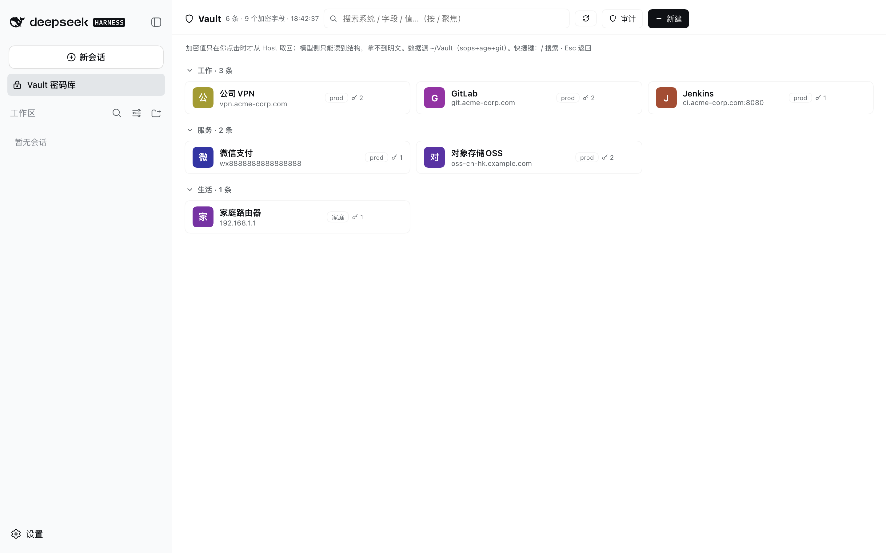
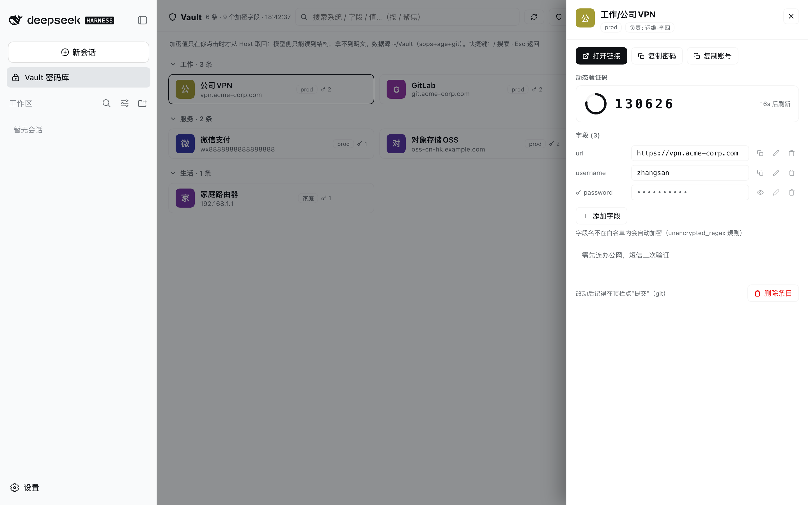
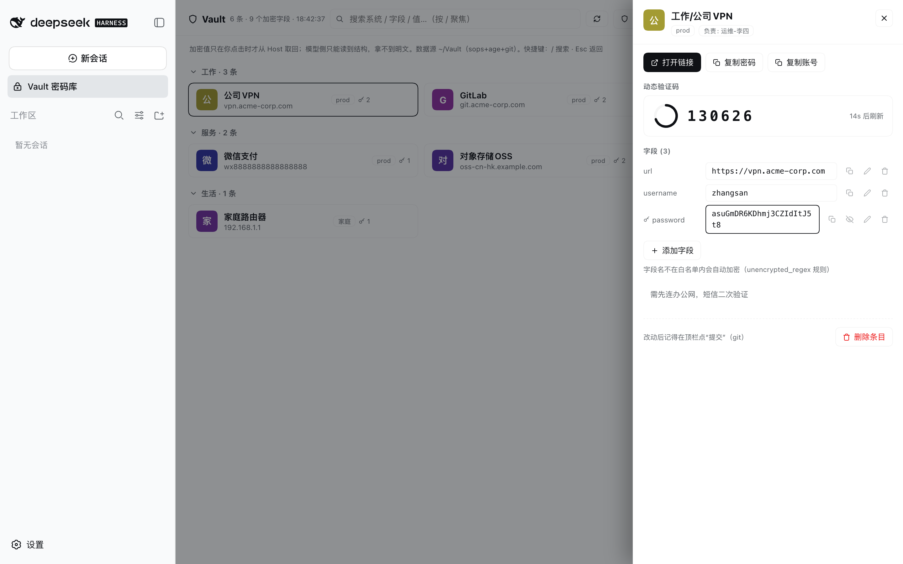

# dsh-plugin-sops-vault

English | [中文](README.zh.md)

A [DeepSeek Harness](https://github.com/deepseek-ai/deepseek-harness) (`dsh`) plugin that turns a local
[sops](https://github.com/getsops/sops) + [age](https://age-encryption.org) + git credential vault into a
first-class sidebar panel of the DSH Web GUI — with a hard security boundary between the human and the model.

```
┌───────────────────────────── DSH Web GUI ─────────────────────────────┐
│  Sidebar: 🔒 Vault panel                                              │
│    · entry rows grouped by prefix, search, git-dirty badge            │
│    · detail drawer: per-field 👁 reveal / copy / edit / delete         │
│    · live TOTP with countdown ring · entry creation · security audit   │
│    · one-click import of browser Authenticator seeds                   │
│    · kind filter: a TOTP-only live-codes view (authenticator style)    │
│    · two-level grouping: group -> company -> entries                   │
│    · configurable logos per group / company / entry                    │
│    · access log (values never logged) · zh/en UI                       │
└──────────────┬─────────────────────────────────────────────────────────┘
               │ same-origin fetch (Origin-checked)
┌──────────────▼───────────────┐        ┌──────────────────────────────┐
│ Host half: /vault-api route   │ shell  │ <vaultDir> (sops + age + git) │
│ inline sops/git driver        ├───────►│ secrets.yaml · .sops.yaml     │
└───────────────────────────────┘        └──────────────────────────────┘

The MODEL gets no tool from this plugin. Structure (parsed from the encrypted
file, no decryption) is the most an agent-side integration should see;
plaintext values only ever flow Host→browser on an explicit human click.
```

## Screenshots

List view (grouped entries, encrypted-field badges, quick actions on hover):



Detail drawer with live TOTP ring, plus one-click single-field reveal:

| Drawer + TOTP | Field revealed on click |
|---|---|
|  |  |

## Why

Password-manager GUIs (KeePassXC, Bitwarden) are binary-store, human-only tools: no diff, no audit trail,
and wiring an AI agent to them means handing over the master password. A sops+age YAML vault is the
opposite: allowlist-encrypted fields keep structure readable, git keeps history, and everything stays
scriptable. This plugin gives that stack the GUI it was missing — without opening a plaintext channel to
the model.

## Prerequisites

Works with both DSH shell generations: `shell.run` (0.1.x) and `shell.execute` + `execution.result` (0.2.x) — feature-detected per call.


- Node.js `^22.19.0 || >=24.0.0`, pnpm
- `sops`, `age`, `git` on the host PATH (`brew install sops age`)
- A vault repository at `~/Vault` (or `config.vaultDir`) — easiest created by **[sops-vault-kit](https://github.com/skyzhao1223/sops-vault-kit)** (`./install.sh`), containing:
  - `secrets.yaml` — sops-encrypted YAML; entries live under a top-level `systems:` map
  - `.sops.yaml` — creation rules using the **allowlist** mode (`unencrypted_regex`: everything
    encrypted except explicitly public field names like `url`/`appid`/`env`/`owner`/`note`)
  - an age key reachable by sops (default: `~/Library/Application Support/sops/age/keys.txt` on macOS,
    `~/.config/sops/age/keys.txt` on Linux, or `SOPS_AGE_KEY_FILE`)
- `dsh web` (the host half needs the `webServer` and `shell` services)

No other CLI or daemon is required — the plugin drives `sops` and `git` directly.

## Install & mount

```sh
git clone https://github.com/skyzhao1223/dsh-plugin-sops-vault && cd dsh-plugin-sops-vault
pnpm install
pnpm build          # tsc (node half + types) + tsdown (browser bundle)
pnpm test           # 127 unit tests
pnpm verify         # load-path check against the built artifact

dsh web --patch "$PWD/cordis.yml"
```

The overlay inserts one row:

```yaml
- insert:
    - id: vault-panel
      name: './lib/index.js'
      # config:
      #   vaultDir: ~/Vault     # leading ~ is expanded
      #   sopsBin: sops         # resolved via PATH
      #   gitBin: git
      #   timeoutMs: 15000
```

For a published install, replace `name` with the bare package name after installing it into the dsh tree.
Refresh the browser after (re)building the client bundle.

Mounting note: `--patch` is a **global** dsh option — `dsh web --patch <file>` works;
do not sandwich other web options before it (e.g. `dsh web --no-open --patch …` fails
to parse). The browser opens automatically; close the extra tab if unwanted.

## API

One prefix route on the DSH web server; every response is `{ok, data|error}` JSON.

| Endpoint | Method | Purpose |
| --- | --- | --- |
| `/vault-api/meta` | GET | whole-vault structure, parsed from the encrypted file **without decrypting** |
| `/vault-api/reveal` | POST | one field's plaintext (`{name, field}`) — human-click only |
| `/vault-api/totp` | POST | current 6-digit code, computed host-side from the stored seed |
| `/vault-api/totp-batch` | POST | live codes for many entries from **one** decryption (`{names?}`) — backs the 动态码 view |
| `/vault-api/audit` | GET | allowlist/leak audit report |
| `/vault-api/audit-log` | GET | tail of the access log |
| `/vault-api/set` / `rm` / `create` / `save` | POST | field write / delete / new entry / git commit |
| `/vault-api/rename` / `sort` | POST | rename one entry / re-sort all entries |
| `/vault-api/logos` | GET / POST | read the logo config / set or remove one logo (`{scope: group\|sub\|entry, key, logo}`) |
| `/vault-api/logo` | POST | upload a raster image into `<vaultDir>/logos/` (`{name, dataBase64}`) |
| `/vault-api/logo/<name>` | GET | the image bytes, for `` (raster only, traversal-refusing) |

### Logos for groups, companies and entries

`<vaultDir>/logos.json` (plaintext metadata, git-tracked like `systems.md`) maps a group
(`工作`), a company sub-group (`工作/金山办公`) or a full entry name to one logo value. Logos live
OUTSIDE the encrypted document on purpose: they are presentation, not credentials, so no
`.sops.yaml` allowlist change and no vault-wide re-encryption is needed.

A value takes one of four forms — an emoji or ≤2 characters (rendered as the avatar itself), a
bare raster file name served from `<vaultDir>/logos/` (offline-safe), an `http(s)` URL, or an inline
`data:image/...;base64,` URI. An entry with no logo inherits its company's, then its group's.
Renaming an entry (or a whole company prefix) carries its logo across; deleting an entry forgets it.

Uploads are capped at 512 KB, must sniff as PNG/JPEG/GIF/WebP/ICO, and are stored under the sniffed
extension. **SVG is refused**: served from this origin as a document it could run script in the
vault's own origin. The file route also sends `Content-Security-Policy: default-src 'none';
sandbox` and refuses any name that is not a bare raster filename. A remote URL works, but that host
then sees your IP and when you opened the panel — the UI says so where you enter one.
| `/vault-api/dirty` | GET | git dirty state |
| `/vault-api/import-scan` | GET | TOTP entries found in the browser's Authenticator extension (`?lang=zh|en` localizes reasons) |
| `/vault-api/import-apply` | POST | write the selected entries into the vault (`{items:[{id,name,username,url,note,overwrite}]}`) |

### Importing from the Chrome Authenticator extension

The 导入动态码 / *Import codes* toolbar button reads the
[Authenticator](https://github.com/Authenticator-Extension/Authenticator) extension straight off disk:
a built-in read-only LevelDB parser (`src/host/leveldb.ts` — WAL log records, SSTable blocks and a
from-scratch Snappy decompressor, no native dependency) recovers the extension's `OTPStorage` entries
from `<profile>/{Sync,Local} Extension Settings/<ext-id>/`, whichever area the extension's own
`UserSettings.storageLocation` points at. Chrome, Chromium, Edge, Brave, Vivaldi, Arc and Opera are
auto-discovered on macOS/Linux/Windows; `config.browserDataDir` adds a non-standard user-data root.

The scan returns metadata only (issuer, account, type, digits, period, seed **length**). The seed
itself never crosses the API: on apply the host re-reads it from disk and looks it up by `id`, then
writes it with `sops set`. Names, urls and notes are editable per row, with an optional group prefix.

Not supported, reported as such per row: entries the extension encrypted with a passphrase (they need
the extension's argon2 key derivation), and counter-based / non-RFC6238 flavours (HOTP, Steam, Battle.net).
Entries with non-default parameters import fine but carry a warning — the panel's ring always computes
SHA-1 / 6 digits / 30 s.

## Security model

| Surface | What it can reach |
| --- | --- |
| **Model / agent** | Nothing — no tools are registered by this plugin. |
| **Browser panel (human)** | Metadata freely; each plaintext value only on an explicit click; TOTP codes on demand. |
| **Other web origins** | Rejected: any request carrying a cross-origin or `null` `Origin` gets 403. Origin-less callers (your own curl) are allowed — same trust domain as the vault files. |
| **Disk** | The vault stays sops-encrypted (allowlist mode). The plugin writes no plaintext anywhere. |
| **Scraping attempts** | `reveal`/`totp` share a 30/min sliding-window rate limit (in-memory); excess gets 429 with a *treat the GUI as compromised* hint. Blunts bulk-scraping by an XSS'd page. |
| **Logos** | Config writes are rate-limited (30/min) and audit-logged; the image route is traversal-guarded, raster-only, magic-byte verified on upload, and served with a sandboxing CSP. No secret ever travels through it. |
| **Live-codes view** | `totp-batch` decrypts the vault once in host memory (the same exposure `roundtrip` already has) and returns only derived 30-second codes — never a seed. Its own 10/min ceiling; the view polls once per rotation and pauses while the tab is hidden. |
| **Browser import** | The extension store is opened read-only; seeds stay host-side (the API carries `secretLen`, never a seed) and land directly in the sops-encrypted vault. Scan+apply share their own 12/min ceiling. |

**Access log**: every reveal/totp/set/rm/create/save appends one line — ISO time, action, target, source
IP — to `<vaultDir>/.git/dsh-vault-audit.log` (inside `.git/` so git status stays clean; falls back to
`<vaultDir>/.audit.log` for non-git vaults). **Values are never logged.** The audit modal shows the tail.

Note: the DSH page token gates the app shell, **not** plugin-registered `webServer` routes — `/vault-api` is reachable by any local caller without the token (verified). Its guards are the Origin policy plus loopback binding.

Known limits (documented, not solved): the DSH web server binds loopback by default — if you expose it,
put authentication in front. Local processes running as your user can read the vault directly; that is
the pre-existing threat model of any local password store. An XSS inside the DSH GUI could script the
panel's API — same blast radius as any in-page secret manager.

## Development

```
src/index.ts            host plugin: config, /vault-api route, sops/git driver, access log
src/host/vault.ts       pure vault logic (parsing, allowlist audit, TOTP, quoting) — unit-tested
src/host/types.ts       structural types for webServer/shell (no internal deps)
src/host/leveldb.ts     read-only LevelDB parser (WAL + SSTable + Snappy) — unit-tested
src/host/authenticator.ts  browser discovery + Authenticator entry parsing — unit-tested
src/host/logos.ts         logo config store (value forms, traversal guard, rename cascade) — unit-tested
src/client/index.ts     client plugin: slots registration + styles
src/client/VaultPanel.tsx  the panel UI (React from the platform module table)
src/client/logic.ts     pure UI transforms — unit-tested
src/client/i18n.ts      zh/en dictionaries (auto-detect via navigator.language)
tests/fixtures/leveldb.ts  synthetic LevelDB encoders (no real profile in the suite)
scripts/verify.ts       built-artifact load-path verification
cordis.yml              opt-in overlay for `dsh web --patch`
```

The client bundle follows the DSH closure-factory convention (`window.__ModuleLoader__.load`, react and
cordis resolved from the platform module table); see `tsdown.config.ts`.

## Roadmap

- [ ] wire copy into the DSH locale service (currently standalone zh/en dictionaries)
- [ ] screenshots in this README (pending a real mounted run)
- [x] reveal rate-limiting (30/min sliding window, v0.2.0)
- [x] entry rename + one-click sort (v0.3.0)
- [ ] batch edit
- [x] browser Authenticator import (LevelDB reader, scan + apply, v0.4.0)
- [ ] CSV import bridge, KeePassXC `.kdbx` mirror export for mobile
- [ ] optional model-facing read-only tools (`vault_list`, structure-only by design)

## License

MIT © skyzhao1223
